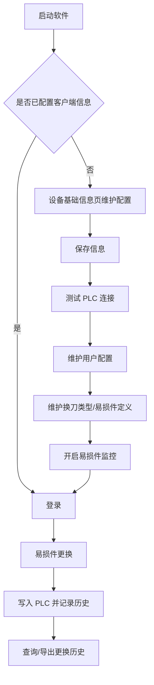

# 易损件防呆管控系统软件操作手册

## 1. 文档目的

本文档用于指导现场操作员、设备工程师、ME/PRD 负责人和系统维护人员使用“易损件防呆管控系统”。内容基于当前软件逻辑和界面截图整理，覆盖首次配置、登录、易损件更换、易损件定义维护、更换记录查询、易损件监控日志、用户配置、托盘运行与退出等完整操作流程。

> 安全说明：截图中的工号、接口地址、令牌、密钥等仅用于界面说明。正式文档不复刻敏感值，现场应按信息安全要求保管 COM、MES、校验接口等配置。

## 2. 角色与权限说明

| 角色 | 主要职责 | 典型操作 |
| --- | --- | --- |
| 操作员 | 执行易损件更换、扫码录入、更换原因登记 | 登录、选择易损件、输入新条码、确认更换、查看最近记录 |
| 设备/工艺维护人员 | 维护设备基础信息、PLC 参数、易损件定义、换刀类型 | 配置资源号、测试 PLC、开启监控、新增/编辑/删除易损件 |
| ME/PRD 负责人 | 接收预警或停机通知，协助确认异常处理 | 在用户配置中维护负责人信息，验证 COM 通知 |
| 系统管理员 | 安装升级、配置导入、语言/自启动/通知/校验参数维护 | 导入旧项目配置、导入旧库易损件、配置用户环境 |

## 3. 软件总体界面说明

主界面由三部分组成：

1. **顶部标题区**：显示 CATL 标识、系统名称、登录用户信息、权限状态、软件版本以及登录/注销按钮。
2. **左侧导航栏**：按业务顺序进入不同页面，包括“易损件更换”“设备基础信息”“易损件管理”“易损件更换历史”“易损件监控日志”“用户配置”；部分工序或版本也会显示“换刀类型管理”。
3. **右侧业务区**：显示当前导航项对应的功能页面、状态提示、表单、按钮和表格。

顶部用户卡片字段说明：

| 字段/按钮 | 作用 | 使用说明 |
| --- | --- | --- |
| 工号 | 当前登录人员工号 | 未登录时显示“--”，登录成功后显示当前工号 |
| 权限 | 当前用户权限等级与自动注销倒计时 | 倒计时到期后系统自动注销，需要重新登录 |
| 软件版本 | 当前客户端版本 | 用于现场反馈问题和版本核对 |
| 登录 | 打开登录窗口 | 未登录时显示；首次未配置客户端信息时按钮不可用 |
| 注销 | 注销当前用户 | 登录后显示；注销后受保护页面需要重新登录 |

## 4. 推荐操作逻辑顺序

首次上线或换线时，建议按以下顺序操作：

1. **启动软件**。
2. **首次维护设备基础信息**：配置基地、工厂、区域、工序、设备编号、资源号、PLC 类型、PLC IP、端口、停机地址等。
3. **保存设备基础信息**。
4. **测试 PLC 连接**：确认网络与 PLC 参数正确。
5. **维护用户配置**：配置语言、自启动、登录认证方式、通知负责人、COM 通知、垫片校验、切刀离线校验等。
6. **维护换刀类型**：如当前工序需要换刀类型校验，先维护名称和编码。
7. **维护易损件定义**：新增或导入旧库易损件，确认每个易损件的寿命地址、阈值地址、条码规则、停机策略等。
8. **开启易损件监控**：在设备基础信息页点击“开启易损件监控”。
9. **登录**：操作员刷卡或输入工号登录。
10. **执行易损件更换**：在易损件更换页选择易损件，录入条码和原因，确认后写入 PLC 并记录历史。
11. **查询和导出更换历史**：按易损件筛选、分页查看或导出 CSV。
12. **最小化到托盘或退出程序**：关闭主窗口时可选择托盘运行或退出。

## 5. 首次启动与未配置状态

对应截图：首次进入“设备基础信息”页面时，顶部登录按钮置灰，页面提示“请先完善客户端信息”。

### 5.1 页面表现

| 界面元素 | 作用 | 操作说明 |
| --- | --- | --- |
| 设备基础信息导航项 | 首次默认进入的配置页 | 未配置时只显示该页，登录入口不可用 |
| 客户端信息表单 | 录入当前设备基础资料与 PLC 参数 | 必填项未完整时无法进行正常登录与业务操作 |
| 状态提示区 | 显示配置状态 | 未配置时提示“请先完善客户端信息” |
| 导入旧项目配置 | 从旧版 SQLite 数据库迁移配置 | 有旧系统数据时优先使用，可减少手动录入 |
| 保存信息 | 保存当前客户端信息 | 修改后按钮可用，保存成功后主界面加载完整导航 |
| 易损件监控状态 | 显示当前监控开关 | 未配置或未开启时显示“未开启监控” |
| 开启/关闭易损件监控 | 控制后台寿命监控任务 | 必须先完成客户端信息配置，开启后更换页才允许操作 |
| 测试 PLC 连接 | 验证 PLC 参数是否可连接 | 必填项完整且监控未开启时可用 |

### 5.2 客户端信息字段说明

| 字段 | 作用 | 填写要求 |
| --- | --- | --- |
| 基地 | 标识设备所属基地 | 从下拉列表选择；影响登录认证、通知和校验上下文 |
| 工厂 | 标识设备所属工厂 | 随基地联动或手动选择可用项 |
| 区域 | 标识设备所属区域 | 用于设备定位和通知内容 |
| 工序 | 标识当前设备工序 | 影响换刀类型校验、切刀离线校验、垫片校验等业务规则 |
| 设备编号 | 现场设备编号 | 用于通知、记录与设备定位 |
| 设备资源号 | 系统识别当前设备的关键编号 | 必填；登录、易损件定义、更换记录均按资源号关联 |
| PLC 类型 | 选择 PLC 通讯协议 | 支持 SiemensS1500、SiemensS1200 等；不同协议显示不同扩展字段 |
| IP 地址 | PLC 网络地址 | 必填；测试连接与运行监控依赖该地址 |
| 端口 | PLC 通讯端口 | Siemens 默认常用 102；必须为整数 |
| 停机地址 | PLC 停机点位 | 寿命达到停机阈值且启用强制停机时使用 |
| 机架号/插槽号 | Siemens PLC 参数 | Siemens 类型显示；范围 0 到 255 |
| 字符串反转 | 特定 PLC 字符串写入规则 | ModbusTcp/Inovance 等协议可能显示 |

### 5.3 首次配置步骤

1. 点击左侧“设备基础信息”。
2. 选择“基地”“工厂”“区域”“工序”。
3. 输入“设备编号”“设备资源号”。
4. 选择 PLC 类型，输入 PLC IP、端口、停机地址。
5. 如为 Siemens PLC，确认机架号和插槽号。
6. 如有旧版数据库，点击“导入旧项目配置”，选择旧系统 SQLite 数据库。
7. 点击“保存信息”。
8. 保存成功后，点击“测试 PLC 连接”。
9. 连接成功后，根据现场需要点击“开启易损件监控”。

## 6. 登录与注销

对应截图：点击右上角“登录”后出现登录弹窗，弹窗展示当前资源号和基地，并根据当前认证方式提示“请刷卡登录”或“请输入工号”。

### 6.1 登录窗口字段说明

| 界面元素 | 作用 | 使用说明 |
| --- | --- | --- |
| 当前资源号 | 当前客户端绑定设备 | 核对是否为本机台资源号 |
| 基地 | 当前客户端所属基地 | 登录认证按基地配置请求 |
| 输入框 | 刷卡/工号输入 | 由“用户配置 > 用户环境配置 > 使用工号认证”决定；未勾选时按卡号刷卡登录，勾选后按工号登录 |
| 状态提示 | 显示登录状态或错误原因 | 如未刷卡、用户不存在、登录成功等 |
| 登录按钮 | 提交身份校验 | 输入有效卡号/工号后点击或回车 |

### 6.2 登录步骤

1. 确认“设备基础信息”已配置完成。
2. 点击右上角“登录”。
3. 在弹窗中按当前认证方式完成登录：刷卡模式刷员工卡，工号模式输入工号。
4. 点击“登录”。
5. 登录成功后，顶部显示工号、权限等级和自动注销倒计时。

### 6.3 注销规则

- 点击右上角“注销”可主动退出当前登录状态。
- 长时间无鼠标/键盘操作时，系统会根据配置自动注销。
- 注销后，受保护业务页面会要求重新登录。
- 未登录时如尝试退出已配置设备的后台程序，系统会要求先登录后再退出。

### 6.4 登录认证方式切换

1. 点击左侧“用户配置”。
2. 在“用户环境配置”中找到“使用工号认证”。
3. 勾选后，登录窗口按 `work_id` 进行认证。
4. 不勾选时，登录窗口按 `card_id` 进行认证。
5. 点击“保存信息”后生效；再次打开登录弹窗时，系统按最新设置执行认证。

## 7. 易损件更换页

对应截图：登录后默认进入“易损件更换”页面。页面上方显示当前资源号、刷新按钮和监控状态提示；左侧为当前易损件概览、寿命阈值和条码规则，右侧为更换录入，下方为更换记录。

### 7.1 页面功能区说明

| 功能区 | 作用 | 关键逻辑 |
| --- | --- | --- |
| 状态提示 | 显示当前页面是否允许操作 | 未开启监控时提示“不允许操作”，更换区置灰 |
| 当前资源号 | 显示本机资源号 | 用于确认当前操作对象 |
| 刷新 | 重新加载当前资源号下的易损件定义、寿命值和历史 | 当 PLC 或主数据变化后使用 |
| 当前易损件概览 | 选择并展示待更换易损件 | 选择易损件后系统加载 PLC 当前寿命值和最近条码 |
| 寿命阈值 | 显示当前寿命、预警寿命、停机寿命 | 数据来自 PLC 或更换预览，异常时禁止更换 |
| 条码规则 | 显示输入方式、最小长度、最大长度 | 更换前系统校验新条码合法性 |
| 更换录入 | 输入更换原因、新条码、备注及工序附加字段 | 满足校验条件后“更换”按钮可用 |
| 更换记录 | 展示当前易损件的最近更换记录 | 更换成功后自动追加/刷新 |

### 7.2 更换录入字段说明

| 字段 | 作用 | 使用说明 |
| --- | --- | --- |
| 更换原因 | 标识本次更换原因 | 如寿命到期、正常更换等；必选 |
| 新条码 | 新易损件编码 | 必填；需符合条码长度、输入方式及业务校验规则 |
| 备注 | 本次更换补充说明 | 可选，保存到更换历史 |
| 工具编码 | 换刀类工序的工具校验编码 | 当工序要求换刀校验时必选 |
| 膜卷号 | 切刀/相关工序附加校验信息 | 当工序与易损件类型要求时必填 |
| 毛刺结果 | 切刀离线校验结果 | 当切刀校验启用时必选 OK/NG |
| A/B 面 | 涂布垫片校验的 A/B 面 | 当涂布校验启用时必选 |
| 更换 | 执行更换 | 确认后立即写入 PLC，并记录更换历史 |

### 7.3 更换操作步骤

1. 登录系统。
2. 确认设备基础信息页中的“易损件监控状态”为“已开启监控”。
3. 点击“易损件更换”。
4. 点击“刷新”，加载最新定义和寿命值。
5. 在“当前易损件”下拉框选择要更换的易损件。
6. 核对当前寿命、预警寿命、停机寿命和当前条码。
7. 选择“更换原因”。
8. 按页面要求填写工具编码、膜卷号、毛刺结果、A/B 面等附加字段。
9. 输入或扫码“新条码”。
10. 如有必要填写备注。
11. 点击“更换”。
12. 阅读确认弹窗，确认无误后继续。
13. 系统写入 PLC、保存更换记录，并清空新条码等输入项。
14. 在页面下方或“易损件更换历史”页确认记录已生成。

### 7.4 更换限制与提示

- 未开启易损件监控时，更换页显示提示并禁止操作。
- 当前客户端未配置资源号时，无法执行更换。
- 当前资源号没有易损件定义时，需先到“易损件管理”新增或导入。
- 当前寿命、预警寿命、停机寿命读取异常时，需先排查 PLC 点位与数据类型。
- 如果新条码曾作为当前设备旧件使用过，系统会提示“旧件回装”确认。
- 如果旧件寿命已达到预警寿命，系统会再次提醒风险。

## 8. 易损件管理页

对应截图：页面显示当前资源号、易损件名称查询框、查询/刷新/新增/编辑/删除/导入旧库易损件按钮，以及易损件定义表格。

### 8.1 功能按钮说明

| 按钮/字段 | 作用 | 使用说明 |
| --- | --- | --- |
| 易损件名称 | 按名称过滤易损件定义 | 输入关键字后点击“查询” |
| 查询 | 执行本地筛选 | 只筛选当前已加载列表 |
| 刷新 | 重新从数据库加载当前资源号的定义 | 新增、编辑、删除后可使用 |
| 新增 | 打开“添加易损件”弹窗 | 当前资源号有效时可用 |
| 编辑 | 编辑选中易损件 | 需先选中一行 |
| 删除 | 删除选中或勾选的易损件 | 执行前弹出确认，支持批量删除 |
| 导入旧库易损件 | 从旧版 SQLite 数据库导入定义 | 用于旧系统迁移，导入后显示新增/更新/跳过数量 |
| 勾选 | 批量选择 | 勾选表头可全选当前列表 |

### 8.2 表格字段说明

| 字段 | 作用 |
| --- | --- |
| 资源号 | 易损件定义归属设备 |
| 名称 | 易损件显示名称 |
| 易损件类型 | 分类，如切刀等 |
| 寿命类型 | 记米、计次、计时 |
| 到期停机 | 达到停机寿命后是否强制停机 |
| 当前寿命地址 | 读取当前寿命的 PLC 点位 |
| 当前寿命数据类型 | 当前寿命点位的数据类型 |
| 预警寿命地址 | 读取预警阈值的 PLC 点位 |
| 预警寿命数据类型 | 预警阈值点位的数据类型 |
| 停机寿命地址 | 读取停机阈值的 PLC 点位 |
| 停机寿命数据类型 | 停机阈值点位的数据类型 |
| 输入方式 | 手动或扫码枪/刷卡器键盘输入 |
| 条码最小长度 | 新条码最短长度限制 |
| 条码最大长度 | 新条码最长长度限制 |
| 附加清零地址 | 更换后需要额外清零的 PLC 点位，可为空 |
| 易损件条码地址 | 更换时写入 PLC 的条码地址，可为空 |
| 创建/更新信息 | 主数据审计信息 |

### 8.3 新增/编辑易损件弹窗

对应截图：添加/编辑弹窗展示当前资源号、易损件基础字段、寿命点位、条码规则和保存按钮。

| 字段 | 作用 | 填写建议 |
| --- | --- | --- |
| 资源号 | 当前设备资源号 | 自动带出，不建议手动修改 |
| 易损件名称 | 定义名称 | 同一资源号下不可重复 |
| 易损件类型 | 业务分类 | 影响切刀/涂布等附加校验规则 |
| 当前寿命地址 | PLC 当前寿命点位 | 必填，需与 PLC 实际地址一致 |
| 预警寿命地址 | PLC 预警阈值点位 | 必填 |
| 停机寿命地址 | PLC 停机阈值点位 | 必填 |
| 寿命类型 | 记米/计次/计时 | 与现场寿命统计方式一致 |
| 寿命到期强制停机 | 是否达到停机阈值后停机 | 高风险易损件建议开启 |
| 当前/预警/停机寿命数据类型 | PLC 点位数据格式 | 需与 PLC 地址的数据类型一致，例如 FLOAT |
| 条码输入模式 | 手动或扫码枪/刷卡器 | 扫码枪模式适用于防手输场景 |
| 条码最小/最大长度 | 条码长度校验 | 按现场条码规则设置 |
| 易损件条码地址 | 更换时写入 PLC 的条码点位 | 可为空；如 PLC 需要记录条码则填写 |
| 附加清零地址 | 更换后需要清零的额外点位 | 可为空；用于现场联动清零 |

新增步骤：

1. 进入“易损件管理”。
2. 点击“新增”。
3. 填写易损件名称、类型、寿命地址、数据类型、输入模式和条码长度。
4. 根据需要开启“寿命到期强制停机”、填写条码写入地址或清零地址。
5. 点击“添加易损件”。
6. 返回列表确认新增记录。

编辑步骤：

1. 在表格中选中一条易损件。
2. 点击“编辑”。
3. 修改需要调整的字段。
4. 点击“保存修改”。
5. 返回列表确认更新结果。

删除步骤：

1. 单条删除：选中一行后点击“删除”。
2. 批量删除：勾选多行后点击“删除”。
3. 在确认弹窗中选择“是”。
4. 删除后列表自动刷新。

## 9. 换刀类型管理页

当前截图未单独展示该页，但左侧导航和系统逻辑包含该功能。该页用于维护换刀类型主数据，为易损件更换页中的“工具编码”提供选项和校验依据。

| 功能 | 作用 | 使用说明 |
| --- | --- | --- |
| 名称 | 换刀类型显示名称 | 如切刀、模切刀等现场名称 |
| 编码 | 工具校验编码 | 更换时用于校验或自动带出 |
| 筛选 | 按名称或编码查询 | 输入关键字后点击“查询” |
| 新增 | 新建换刀类型 | 名称和编码均必填 |
| 编辑 | 修改选中换刀类型 | 需先选中列表行 |
| 删除 | 删除选中或勾选项 | 删除前会弹出确认 |
| 刷新 | 重新加载主数据 | 数据异常或多人维护后使用 |

推荐顺序：先维护换刀类型，再维护需要该类型校验的易损件定义，最后在更换页选择对应工具编码执行更换。

## 10. 易损件更换历史页

对应截图：页面显示当前资源号、刷新按钮、易损件筛选框、查询/导出按钮、更换记录表格和分页控件。

### 10.1 功能说明

| 功能 | 作用 | 使用说明 |
| --- | --- | --- |
| 当前资源号 | 当前查询的设备资源号 | 只查询当前客户端资源号的数据 |
| 刷新 | 重新加载易损件定义和更换历史 | 数据未更新时点击 |
| 易损件筛选 | 按易损件查看历史 | 不选择则查询全部 |
| 查询 | 应用当前筛选条件 | 查询后表格和分页刷新 |
| 导出 | 导出当前筛选结果为 CSV | 有记录时可用 |
| 分页大小 | 每页显示条数 | 支持 10、20、50、100 |
| 上一页/下一页 | 翻页查看记录 | 根据总页数自动启用/禁用 |
| 跳转页码 | 进入指定页 | 输入大于 0 的页码 |

### 10.2 表格字段说明

| 字段 | 作用 |
| --- | --- |
| 名称 | 易损件名称 |
| 当前编码 | 更换前条码 |
| 新编码 | 更换后条码 |
| 当前寿命 | 更换时读取到的当前寿命 |
| 预警寿命 | 更换时读取到的预警阈值 |
| 停机寿命 | 更换时读取到的停机阈值 |
| 更换原因 | 操作员选择的更换原因 |
| 更换时间 | 更换记录生成时间 |
| 更换人员 | 用户配置中维护的更换人员姓名 |
| 操作员 | 登录人员工号 |

### 10.3 查询与导出步骤

1. 点击“易损件更换历史”。
2. 点击“刷新”。
3. 在“易损件”下拉框选择指定易损件；如需全部记录，保持“不选则查询全部”。
4. 点击“查询”。
5. 如需导出，点击“导出”，选择 CSV 保存位置。
6. 使用分页控件查看更多记录。

## 11. 易损件监控日志页

对应截图：页面顶部显示状态摘要、筛选条件和操作按钮，中间为日志列表，下方为选中日志的详情区域。

### 11.1 页面功能说明

| 功能/字段 | 作用 | 使用说明 |
| --- | --- | --- |
| 状态提示 | 显示当前页条数、页码、匹配条数和保留条数 | 用于判断当前是否在实时刷新、暂停状态以及当前内存保留量 |
| 级别 | 按日志级别筛选 | 支持“调试、信息、警告、错误”，默认显示全部 |
| 来源 | 按日志来源筛选 | 支持“监控服务、PLC、COM”，便于快速定位问题来源 |
| 筛选 | 关键字过滤 | 可按消息、操作、资源号或地址过滤日志 |
| 自动滚动 | 新增日志时自动定位最新记录 | 查看实时变化时保持开启，查看历史时建议关闭 |
| 刷新 | 重新加载当前筛选结果 | 切换筛选条件后或暂停后可手动刷新确认结果 |
| 较新/较旧 | 在日志页之间切换 | 默认每页显示 200 条，用于查看较新的或较旧的日志 |
| 暂停/继续 | 暂停或恢复实时刷新 | 暂停后表格不自动跳动，继续后恢复最新页显示 |
| 清空 | 清空当前内存保留的全部监控日志 | 适合重新观察某一次监控、报警或排障过程 |
| 复制 | 复制当前选中日志的完整内容 | 复制内容包含时间、级别、来源、消息和详情 |
| 导出 | 导出当前筛选条件下的全部保留日志 | 导出为 CSV，便于转交工程、设备或质量人员排查 |

### 11.2 表格与详情区说明

| 列/区域 | 作用 | 使用说明 |
| --- | --- | --- |
| 时间 | 日志产生时间 | 用于还原事件先后顺序 |
| 级别 | 当前日志的重要程度 | 警告和错误会高亮显示 |
| 来源 | 日志来自监控服务、PLC 或 COM | 便于区分业务处理和通讯异常 |
| 操作 | 对应的监控动作或通讯动作 | 如读取寿命、写入停机信号、发送通知 |
| 资源号 | 当前日志关联的设备资源号 | 多设备排查时重点核对 |
| 地址 | 相关 PLC 地址或点位 | PLC 读写异常时重点查看 |
| 消息 | 本条日志摘要 | 用于快速判断执行结果 |
| 详情 | 选中日志的扩展信息 | 显示在页面底部，便于复制和导出前确认 |

### 11.3 日志查看步骤

1. 点击左侧“易损件监控日志”。
2. 先查看顶部状态提示，确认当前匹配条数、页码和保留条数。
3. 按需要选择“级别”“来源”或输入关键字。
4. 如需查看历史记录，先取消“自动滚动”，再点击“较旧”或“较新”翻页。
5. 如需冻结当前画面，点击“暂停”；排查完成后点击“继续”恢复实时刷新。
6. 选中一条日志，在底部“详情”区域查看完整内容。
7. 如需留档或转交排查，点击“复制”或“导出”。

### 11.4 使用注意点

- 当停留在较旧页面或点击“暂停”时，顶部统计仍会更新，但表格不会自动跳到最新日志。
- 清空后仅保留后续新产生的日志，已清空的内存日志不会再次显示。
- 导出内容仅包含当前筛选条件下仍保留在内存中的日志，不包含已清空的历史日志。

## 12. 用户配置页

对应截图：用户配置页包含用户环境配置、通知配置、垫片校验配置、切刀离线校验配置，页面底部有“保存信息”。

### 12.1 用户环境配置

| 字段 | 作用 | 使用说明 |
| --- | --- | --- |
| 语言 | 设置界面语言 | 支持简体中文、英文；保存后立即切换并作为后续启动默认语言 |
| 使用工号认证 | 控制登录认证使用工号还是卡号 | 勾选后按 `work_id` 认证；不勾选时按 `card_id` 认证登录 |
| 开启自启动 | 控制 Windows 开机自启动 | 选择“开机自启动”或“开机不自启动”后保存 |

### 12.2 通知配置

| 字段/按钮 | 作用 | 使用说明 |
| --- | --- | --- |
| ME 负责人工号/姓名 | 预警和停机通知接收/展示人员 | 至少维护 ME 或 PRD 负责人之一，测试通知需要接收人 |
| PRD 负责人工号/姓名 | 预警和停机通知接收/展示人员 | 与 ME 配合接收异常通知 |
| 更换人员姓名 | 记录和通知中展示的现场更换人员 | 用于通知模板和历史追溯 |
| 启用 COM 通知 | 控制是否发送 COM 消息 | 开启后后台预警/停机会推送通知 |
| PushUrl、DeIpaasKeyAuth、AgentId、模板 ID、UserType | COM 平台基础参数 | 通常由配置文件或管理员维护，现场不要随意修改 |
| ComAccessToken、ComSecret | COM 群消息鉴权 | 敏感信息，仅授权人员维护 |
| 预览测试通知 | 查看预警和停机通知格式 | 不发送消息，只用于格式确认 |
| 测试 COM 通知 | 发送测试群消息和工作消息 | 如当前配置有未保存变更，系统会先保存再测试 |

### 12.3 垫片校验配置

| 字段 | 作用 | 使用说明 |
| --- | --- | --- |
| 启用垫片校验 | 控制涂布相关垫片条码校验 | 开启后更换时按接口校验条码 |
| 校验接口地址 | 垫片校验服务 URL | 由现场服务地址配置 |
| 请求超时 | 校验请求超时时间，单位毫秒 | 必须为大于 0 的整数，默认 5000 |
| 忽略证书错误 | HTTPS 证书异常时是否忽略 | 测试环境常用；生产环境建议按安全要求设置 |
| 条码分隔符 | 解析垫片条码的分隔符 | 默认“/” |
| 条码段数 | 条码解析期望段数 | 默认 8，必须为大于 0 的整数 |

### 12.4 切刀离线校验配置

| 字段 | 作用 | 使用说明 |
| --- | --- | --- |
| 启用切刀离线校验 | 控制切刀更换时是否请求 MES 校验 | 开启后 MES 站点、地址、账号、密码均必填 |
| MES 站点 | MES 站点编码 | 与现场 MES 配置一致 |
| MES 地址 | MES 服务基础地址 | 页面自动拼接固定 WSDL 后缀 |
| MES 账号 | MES 登录账号 | 由现场管理员提供 |
| MES 密码 | MES 登录密码 | 敏感信息，注意保密 |

### 12.5 用户配置保存步骤

1. 点击“用户配置”。
2. 按需设置语言、登录认证方式和开机自启动。
3. 维护 ME/PRD 负责人、更换人员、COM 通知信息。
4. 按现场策略设置垫片校验和切刀离线校验。
5. 点击“保存信息”。
6. 页面提示“用户配置保存成功”后生效。
7. 如启用 COM 通知，先点击“预览测试通知”，确认模板；再点击“测试 COM 通知”验证链路。

## 13. 关闭主窗口、托盘运行与退出

对应截图：关闭主窗口时弹出确认框；选择“是”后系统最小化到托盘，托盘卡片显示当前用户、权限、软件版本，并提供“恢复窗口”“退出程序”。

### 13.1 关闭确认框

| 选项 | 作用 | 结果 |
| --- | --- | --- |
| 是 | 最小化到托盘继续运行 | 主窗口隐藏，后台监控继续运行 |
| 否 | 退出程序 | 已配置设备时需要满足退出校验；退出后后台监控停止 |
| 取消 | 返回主窗口 | 不关闭、不最小化 |

### 13.2 托盘窗口说明

| 功能 | 作用 | 使用说明 |
| --- | --- | --- |
| 系统正在托盘中运行 | 提示后台仍在运行 | 最小化或关闭窗口后仍可监控 |
| 当前用户 | 显示当前登录工号 | 便于核对后台运行身份 |
| 当前权限 | 显示权限等级和自动注销倒计时 | 倒计时到期后自动注销 |
| 软件版本 | 显示版本号 | 用于问题反馈 |
| 恢复窗口 | 恢复主界面 | 单击按钮或双击托盘图标均可恢复 |
| 退出程序 | 停止后台运行并退出 | 已配置设备且未登录时需要先登录；已登录时需确认退出 |

### 13.3 推荐使用方式

- 产线运行中如需隐藏界面，应选择“是”最小化到托盘，不要直接退出程序。
- 需要维护配置、升级或停机时，再选择“退出程序”。
- 退出前确认无正在执行的更换、导入、PLC 测试或配置保存操作。

## 14. 常见业务场景操作指引

### 14.1 新设备首次上线

1. 进入“设备基础信息”。
2. 填写并保存客户端信息。
3. 测试 PLC 连接。
4. 进入“用户配置”，设置负责人、通知、登录认证方式和校验接口。
5. 维护换刀类型。
6. 在“易损件管理”新增易损件定义。
7. 返回“设备基础信息”开启监控。
8. 登录并执行一次测试更换，确认 PLC 写入和历史记录正常。
9. 如需观察后台读写与报警链路，进入“易损件监控日志”查看实时日志。

### 14.2 旧项目迁移

1. 在“设备基础信息”点击“导入旧项目配置”。
2. 选择旧版 SQLite 数据库。
3. 保存并核对资源号、PLC 参数、MHR/MES 相关配置。
4. 在“易损件管理”点击“导入旧库易损件”。
5. 选择同一旧库，等待导入完成。
6. 刷新列表，核对新增/更新/跳过数量。
7. 测试 PLC 连接并开启监控。

### 14.3 正常更换易损件

1. 操作员登录。
2. 进入“易损件更换”。
3. 选择要更换的易损件。
4. 核对寿命和当前条码。
5. 选择更换原因。
6. 根据页面要求填写工具编码、膜卷号、毛刺结果、A/B 面等。
7. 扫描或输入新条码。
8. 点击“更换”并确认。
9. 检查更换记录。

### 14.4 查询追溯记录

1. 进入“易损件更换历史”。
2. 选择易损件或查询全部。
3. 点击“查询”。
4. 按分页查看。
5. 如需留档，点击“导出”保存 CSV。

## 15. 常见异常与处理建议

| 现象 | 可能原因 | 处理建议 |
| --- | --- | --- |
| 登录按钮置灰 | 客户端信息未配置 | 先进入“设备基础信息”完成保存 |
| 刷卡后无法登录或输入工号无效 | 当前登录认证方式与现场使用方式不一致 | 到“用户配置”核对“使用工号认证”是否与现场一致，保存后重新登录 |
| 更换页提示未开启监控 | 设备基础信息中监控未开启 | 回到设备基础信息页点击“开启易损件监控” |
| 测试 PLC 连接不可用 | 必填信息不完整或监控已开启 | 先补齐客户端信息；如需改 PLC 参数，先关闭监控 |
| 保存信息按钮不可用 | 当前表单未发生变化 | 修改字段后才可保存 |
| 新增/编辑/删除按钮不可用 | 未加载当前资源号或未选择行 | 先完成设备配置并刷新列表，编辑/删除需选中数据 |
| 更换按钮不可用 | 条码、原因或附加校验字段未满足 | 按页面提示补齐必填字段，确认寿命值正常 |
| 导出按钮不可用 | 当前筛选结果无记录 | 先刷新/查询，确认有更换记录 |
| COM 通知测试失败 | 负责人、令牌、密钥或接口配置错误 | 核对用户配置和网络连接后重试 |
| 关闭后找不到窗口 | 系统已最小化到托盘 | 双击托盘图标或点击“恢复窗口” |

## 16. 操作注意事项

- 资源号是所有配置、定义、登录和记录关联的核心字段，首次配置必须准确。
- PLC 参数修改前建议先关闭易损件监控，避免后台任务使用旧参数。
- 易损件定义中的 PLC 地址和数据类型必须与 PLC 程序一致，否则寿命读取、停机判断和写入可能失败。
- 启用“寿命到期强制停机”前，应确认停机点位和现场停机策略。
- COM、MES、垫片校验接口包含敏感信息，应由授权人员维护。
- 软件升级会保留用户数据和配置；真实卸载会删除安装根目录及本地数据，卸载前请先备份需要保留的信息。
